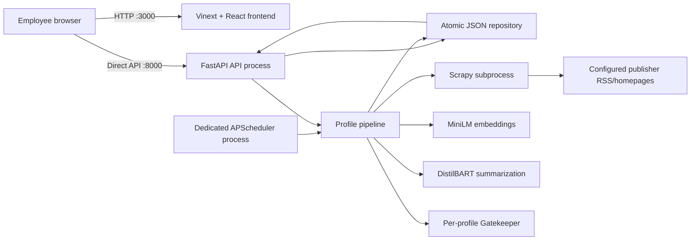
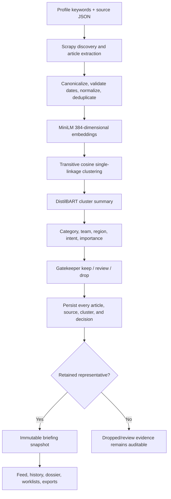

# Signalroom setup, configuration, architecture, and operations guide

This is the main handoff document for the repository. It explains what must be
downloaded, exactly where configuration lives, how the frontend and backend
work, how to run the system from a Git clone, and how to assemble the internal
Windows-laptop release.

## 1. Start here: the four settings you will edit most often

| What you want to change | Exact place |
| --- | --- |
| Broadcast-profile IP addresses | `SIGNALROOM_BROADCAST_IPS` in the ignored production `signalroom.env.cmd` copied from [`deployment/signalroom.env.cmd.example`](deployment/signalroom.env.cmd.example) |
| Developer/admin IP addresses | `SIGNALROOM_DEVELOPER_IPS` and `SIGNALROOM_ADMIN_IPS` in the same file |
| Default keywords | `keywords` in [`backend/profiles/default.json`](backend/profiles/default.json) |
| Broadcast keywords | `keywords` in [`backend/profiles/broadcast.json`](backend/profiles/broadcast.json) |
| Default publisher sources | [`backend/sites/sites.json`](backend/sites/sites.json) |
| Broadcast publisher sources | [`backend/sites/broadcast_sites.json`](backend/sites/broadcast_sites.json) |
| MiniLM files | `backend/model_weights/all-MiniLM-L6-v2/` |
| DistilBART files | `backend/model_weights/distilbart-cnn-12-6/` |

Profile and source JSON is reloaded at the beginning of every manual or
scheduled pipeline run. Changing a keyword, source, threshold, or enablement
flag therefore does not require rebuilding the frontend or restarting the API.

The backend `.env.example` file is documentation only. The Python application
does **not** automatically load `.env` files. Export variables in the shell, use
a service manager, or use `signalroom.env.cmd` with the Windows launcher.

## 2. The two Hugging Face models

Signalroom uses two different models for two different jobs. The summarizer is
DistilBART, not DistilBERT.

| Purpose | Hugging Face repository | Pinned revision | Local destination |
| --- | --- | --- | --- |
| Semantic embeddings and clustering | [`sentence-transformers/all-MiniLM-L6-v2`](https://huggingface.co/sentence-transformers/all-MiniLM-L6-v2) | `1110a243fdf4706b3f48f1d95db1a4f5529b4d41` | `backend/model_weights/all-MiniLM-L6-v2/` |
| Abstractive cluster summarization | [`sshleifer/distilbart-cnn-12-6`](https://huggingface.co/sshleifer/distilbart-cnn-12-6) | `eb8b5a5eb7de268c0d7db6fa247188c909acf265` | `backend/model_weights/distilbart-cnn-12-6/` |

Both model pages identify the checkpoints as Apache-2.0. Review the model cards
and your company's model-use policy before internal deployment.

### 2.1 Recommended download method

Install the Python requirements first, then run the checked-in downloader from
the repository root:

```powershell
.\.venv\Scripts\python.exe -m pip install -r requirements.txt
.\.venv\Scripts\python.exe backend\scripts\download_models.py
```

For the portable release runtime, use:

```bat
python_embed\python.exe -m pip install -r requirements.txt
python_embed\python.exe backend\scripts\download_models.py
```

[`backend/scripts/download_models.py`](backend/scripts/download_models.py):

- downloads only the files needed by Sentence Transformers and Transformers;
- selects `model.safetensors` instead of pickle-backed model weights;
- pins both repository revisions so a later Hub update cannot silently change
  the release;
- verifies the SHA-256 of each weight file;
- downloads about 1.32 GB of weights instead of every ONNX, OpenVINO, TensorFlow,
  JAX, Rust, and PyTorch variant in both repositories.

The expected weight checksums are:

```text
MiniLM model.safetensors
53aa51172d142c89d9012cce15ae4d6cc0ca6895895114379cacb4fab128d9db

DistilBART model.safetensors
bb2e2ae9c5e339a6e86adac3c946bb853db50d7c588477ddd1622dd2d1fc567c
```

The models are public, so no Hugging Face access token is required. Do not put a
token in a command-line argument or commit one to Git.

### 2.2 Resulting folder layout

After downloading, the important portion of the repository looks like this:

```text
backend/
├── model_weights/
│   ├── all-MiniLM-L6-v2/
│   │   ├── 1_Pooling/config.json
│   │   ├── config.json
│   │   ├── model.safetensors
│   │   ├── modules.json
│   │   ├── tokenizer.json
│   │   └── ...
│   └── distilbart-cnn-12-6/
│       ├── config.json
│       ├── merges.txt
│       ├── model.safetensors
│       ├── tokenizer_config.json
│       └── vocab.json
└── models/
    ├── default/             # generated Gatekeeper artifacts, not HF weights
    └── broadcast/           # generated Gatekeeper artifacts, not HF weights
```

The hidden `.gitignore` inside each `model_weights` destination keeps the empty
folder in Git while preventing the downloaded files from being committed.
Never put Hugging Face weights in `backend/models`; that is the trusted
Gatekeeper `.pkl` artifact directory.

### 2.3 Tell the backend to use the folders

The model IDs remain stable logical identities, while the two `_PATH` variables
select the physical folders. Relative paths are resolved against `backend/`, not
against whichever terminal directory happens to be active.

PowerShell development session:

```powershell
$env:SIGNALROOM_HF_LOCAL_ONLY = "true"
$env:SIGNALROOM_EMBEDDING_MODEL = "sentence-transformers/all-MiniLM-L6-v2"
$env:SIGNALROOM_SUMMARIZATION_MODEL = "sshleifer/distilbart-cnn-12-6"
$env:SIGNALROOM_EMBEDDING_MODEL_PATH = "model_weights/all-MiniLM-L6-v2"
$env:SIGNALROOM_SUMMARIZATION_MODEL_PATH = "model_weights/distilbart-cnn-12-6"
```

The production [`deployment/signalroom.env.cmd.example`](deployment/signalroom.env.cmd.example)
already contains these path variables. Copy it to `signalroom.env.cmd` in the
assembled release root and keep that real file out of Git.

### 2.4 Verify both models offline

Run strict warmup after setting the paths:

```powershell
.\.venv\Scripts\python.exe backend\main.py warm-models --strict
```

A successful result exits with code `0` and resembles:

```json
{
  "ready": true,
  "local_files_only": true,
  "models": {
    "embedding": {
      "backend": "sentence_transformers",
      "model": "sentence-transformers/all-MiniLM-L6-v2",
      "degraded": false
    },
    "summarization": {
      "backend": "distilbart",
      "model": "sshleifer/distilbart-cnn-12-6",
      "degraded": false
    }
  }
}
```

Do not use `warm-models --allow-download` to populate the explicit folders.
`download_models.py` performs the single network step; strict warmup is the
offline verification step.

### 2.5 Is copying the model files the only remaining ML task?

No. The application can run before the download using deterministic fallbacks,
but activating the intended ML path requires all of the following:

1. Install the `ml` dependencies through the root `requirements.txt`.
2. Download both pinned model snapshots.
3. Set both `_MODEL_PATH` variables.
4. Make strict warmup return `"ready": true`.
5. Collect genuine keep/drop actions for each profile.
6. Train the Default and Broadcast Gatekeepers after MiniLM is active.

Until a valid Gatekeeper artifact exists, the Gatekeeper fails open: it keeps
articles and records degraded evidence instead of silently deleting news.

## 3. Configure IP-based profiles and permissions

### 3.1 Where production IPs go

Do not hard-code real employee IPs in Python or commit them to the public
repository. In the assembled Windows release:

1. Copy `deployment\signalroom.env.cmd.example` to
   `Signalroom\signalroom.env.cmd`.
2. Edit the copied file.
3. Enter comma-separated individual IP addresses and/or CIDR networks.

Example only:

```bat
set "SIGNALROOM_BROADCAST_IPS=10.20.30.41,10.20.30.42,10.20.40.0/24"
set "SIGNALROOM_DEVELOPER_IPS=127.0.0.1,::1,10.20.30.10"
set "SIGNALROOM_ADMIN_IPS=10.20.30.10"
```

Replace every example with the real internal network values. A single IPv4
address is normalized as a `/32`; a single IPv6 address is normalized as a
`/128`.

### 3.2 What each allowlist does

| Variable | Result |
| --- | --- |
| `SIGNALROOM_BROADCAST_IPS` | Broadcast becomes the viewer's automatic desk and the Broadcast API is permitted |
| `SIGNALROOM_DEVELOPER_IPS` | Viewer can switch Default/Broadcast, inspect analytics and Gatekeeper review, manage sources, and manage scans |
| `SIGNALROOM_ADMIN_IPS` | Viewer receives all backend capabilities |
| `SIGNALROOM_ADMIN_EMAILS` | Same administrative result, but only when the email comes from trusted identity middleware |
| `SIGNALROOM_ANALYTICS_EMAILS` | Adds analytics access to a verified identity |

An unknown reachable IP receives the Default profile and the base read,
personalization, export, and VOC capabilities. Therefore the internal firewall
and authenticated network are part of the security boundary; CORS is not user
authentication.

If an IP is both developer and Broadcast, it receives developer controls and
opens on Broadcast by default. It can then switch desks. An ordinary Broadcast
IP cannot request Default unless it also has profile-switch capability.

### 3.3 Direct API versus reverse proxy

The single-laptop pilot uses direct browser-to-backend calls on port `8000` so
FastAPI sees the employee device IP. Build the frontend with:

```powershell
$env:NEXT_PUBLIC_SIGNALROOM_DIRECT_API_PORT = "8000"
```

Configure the backend with the exact frontend origin:

```bat
set "SIGNALROOM_CORS_ORIGINS=http://YOUR-SERVER-IP:3000"
```

If a company reverse proxy is introduced later, it must replace—not append or
trust from the browser—the forwarding, identity, and Signalroom secret headers.
Only then enable trusted proxy settings. See
[`deployment/README_WINDOWS.md`](deployment/README_WINDOWS.md).

### 3.4 Pseudonymous identity behavior

Raw client IPs are HMAC-hashed before use as actor IDs. Names and optional email
addresses entered in the profile panel are preferences attached to that actor;
they are not authentication. People behind the same NAT or forward proxy share
one pseudonymous actor unless verified company identity is introduced.

Generate a unique production `SIGNALROOM_IP_HASH_SECRET` of at least 32 random
bytes. Changing it later creates new pseudonymous actor IDs, so existing user
preferences and personal worklists will no longer join to the same viewers.

## 4. Configure keywords, profiles, and sources

### 4.1 Keywords and thresholds

Edit these arrays directly:

- Default: [`backend/profiles/default.json`](backend/profiles/default.json)
- Broadcast: [`backend/profiles/broadcast.json`](backend/profiles/broadcast.json)

Each profile file contains:

```json
{
  "schema_version": 1,
  "id": "default",
  "label": "Default Intelligence",
  "enabled": true,
  "sources_file": "sites.json",
  "cluster_similarity_threshold": 0.78,
  "gatekeeper_review_threshold": 0.45,
  "gatekeeper_drop_threshold": 0.60,
  "prefetch_drop_threshold": 0.90,
  "schedule_order": 1,
  "keywords": ["OpenAI", "Samsung", "OLED"]
}
```

Rules:

- keep keywords non-empty and unique without regard to case;
- Default and Broadcast may use completely different keywords;
- `schedule_order` is `1` for Default and `2` for Broadcast;
- `0.78` is the cosine-similarity edge used to form connected clusters;
- final Gatekeeper results are keep below `0.45`, review from `0.45` to below
  `0.60`, and drop at or above `0.60`;
- the `0.90` prefetch threshold exists in the classifier contract, but the
  current crawl pipeline invokes Gatekeeper only after clustering and
  summarization.

### 4.2 Publisher source files

Default sources are isolated from Broadcast sources:

```text
backend/sites/sites.json             # Default
backend/sites/broadcast_sites.json   # Broadcast
```

Representative source object:

```json
{
  "id": "publisher-slug",
  "name": "Publisher name",
  "enabled": true,
  "category": "Broadcasting",
  "rss_url": "https://publisher.example/rss.xml",
  "homepage": "https://publisher.example/news/",
  "region": "India",
  "timezone": "Asia/Kolkata",
  "allowed_domains": ["publisher.example"],
  "max_links": 100,
  "allow_deep_scan": false,
  "manual_deep_scan_candidate": false
}
```

At least one of `rss_url`, `homepage`, or `url` is required. Keep
`allowed_domains` within the publisher's real domain boundary. `max_links` is
capped at 500. `manual_deep_scan_candidate` is only an operator label;
`allow_deep_scan` is what actually permits homepage/listing fallback.

Source URLs added through the administrator UI are written back through the
validated source API. The API rejects credentials in URLs, localhost/private
literal targets, suspicious internal names, and non-HTTP(S) schemes.

Always confirm publisher terms, robots policy, and the company's content-use
policy before enabling a source.

## 5. Clone and install on a Windows development machine

The published repository is:

```text
https://github.com/stark-craft/velvet-penguin-lantern
```

Recommended prerequisites:

- Git for Windows;
- 64-bit CPython 3.11 or 3.12;
- Node.js 22.13 or newer;
- several gigabytes of free disk space;
- preferably 16 GB RAM for comfortable DistilBART CPU inference.

Clone and enter the repository:

```powershell
git clone https://github.com/stark-craft/velvet-penguin-lantern.git
cd velvet-penguin-lantern
```

Create a Python environment and install every backend, ML, and test dependency:

```powershell
py -3.11 -m venv .venv
.\.venv\Scripts\python.exe -m pip install --upgrade pip
.\.venv\Scripts\python.exe -m pip install -r requirements.txt
```

The root [`requirements.txt`](requirements.txt) installs the backend project
with both `dev` and `ml` extras. The canonical dependency ranges live in
[`backend/pyproject.toml`](backend/pyproject.toml). The install is deliberately
non-editable, which avoids an absolute `.pth` reference back to a build machine
when a Python runtime is packaged.

Install the frontend separately with npm:

```powershell
npm ci
```

Python packages cannot install JavaScript packages; `requirements.txt` and
`package-lock.json` therefore serve different runtimes.

Download and verify the models using section 2.

## 6. Run from a normal Git clone

A development clone uses three processes: API, scheduler, and frontend.

### Terminal 1: backend API

Set development values in the terminal session, then start the API:

```powershell
$env:SIGNALROOM_ENV = "development"
$env:SIGNALROOM_IP_HASH_SECRET = "development-only-change-this-ip-hash-secret"
$env:SIGNALROOM_HF_LOCAL_ONLY = "true"
$env:SIGNALROOM_EMBEDDING_MODEL_PATH = "model_weights/all-MiniLM-L6-v2"
$env:SIGNALROOM_SUMMARIZATION_MODEL_PATH = "model_weights/distilbart-cnn-12-6"
.\.venv\Scripts\python.exe backend\main.py api --host 127.0.0.1 --port 8000
```

OpenAPI documentation: `http://127.0.0.1:8000/docs`

Health endpoint: `http://127.0.0.1:8000/api/v1/health`

### Terminal 2: four-hour scheduler

Set the same backend environment variables in the second terminal and run:

```powershell
.\.venv\Scripts\python.exe backend\main.py scheduler
```

The scheduler is a dedicated process. Do not start it inside every Uvicorn
worker. Its default behavior is one cycle shortly after startup and another
cycle every four hours.

### Terminal 3: frontend

From the repository root:

```powershell
$env:NEXT_PUBLIC_SIGNALROOM_DIRECT_API_PORT = "8000"
npm run dev
```

Open `http://127.0.0.1:3000` or the port printed by Vinext.

For access from another private-network machine during development:

```powershell
npm run dev -- --host 0.0.0.0
```

Bind the backend to `0.0.0.0`, set exact CORS origins, and configure the
Windows firewall before using another device.

### Run one pipeline immediately

The scheduler is not required for a manual test:

```powershell
.\.venv\Scripts\python.exe backend\main.py run --profile default
.\.venv\Scripts\python.exe backend\main.py run --profile broadcast
.\.venv\Scripts\python.exe backend\main.py run --profile all
```

`--profile all` follows configured order: Default, then Broadcast. Optional
repeatable overrides include `--keyword` and `--source`.

## 7. Build and run the production frontend from the clone

The internal-laptop topology uses direct API port `8000`:

```powershell
$env:NEXT_PUBLIC_SIGNALROOM_DIRECT_API_PORT = "8000"
npm ci
npm run build
npm run start -- -H 0.0.0.0 -p 3000
```

The npm scripts are Windows-compatible. The frontend is server-rendered and
still needs Node.js at runtime; `dist/` is not a static website that can be
opened directly from the filesystem.

Run the backend API and scheduler in their own processes as described above.

## 8. Assemble the portable Windows-laptop release

[`deployment/start_signalroom.bat`](deployment/start_signalroom.bat) is a
release launcher. It is not intended to run while it remains inside the
`deployment/` folder of an untouched clone.

Assemble this layout:

```text
Signalroom/
├── start_signalroom.bat          # copied from deployment/
├── signalroom.env.cmd            # copied from example, then edited; ignored
├── requirements.txt
├── backend/
│   ├── model_weights/
│   └── runtime/data/             # durable state; preserve during upgrades
├── frontend/                     # copy the frontend/root project here
│   ├── dist/
│   ├── node_modules/
│   ├── package.json
│   └── ...
├── python_embed/
│   ├── python.exe
│   └── ...
├── node_embed/                   # optional portable node.exe
└── logs/                         # created automatically
```

Then double-click `start_signalroom.bat`. It launches exactly one API, one
scheduler, and one production frontend process and rotates one previous log
generation.

Do not copy a macOS/Linux virtual environment or `node_modules` to Windows.
Native wheels and packages must match Windows, CPU architecture, and Python
minor version. If using the official Python embeddable ZIP, enable `import site`
in `pythonXY._pth` before installing packages. Build `python_embed` on the target
Windows laptop or an equivalent clean Windows system.

The complete packaging procedure is in
[`deployment/README_WINDOWS.md`](deployment/README_WINDOWS.md).

## 9. System architecture

### 9.1 Process architecture



The scheduler is not started when FastAPI is imported. Scrapy runs out of
process so Twisted never owns the API event loop. Model loading is lazy inside
each pipeline process.

### 9.2 Repository map

```text
app/                         frontend server entry, access rules, API proxy
components/                  UI workspace, views, cards, drawers, tooltips
lib/signalroom-client.ts     frontend HTTP client and API-to-UI mapping
types/news.ts                frontend contracts
app/globals.css              themes, profiles, responsive layout
public/                      frontend image assets

backend/main.py              ASGI export and operational CLI
backend/profiles/            profile keywords, thresholds, schedule order
backend/sites/               Default/Broadcast source configuration
backend/model_weights/       downloaded MiniLM and DistilBART snapshots
backend/models/              generated Gatekeeper classifiers/manifests
backend/runtime/             active JSON state, crawl output, scheduler lock
backend/signalroom/api.py    /api/v1 route implementations
backend/signalroom/app.py    FastAPI composition and middleware
backend/signalroom/config.py validated environment and paths
backend/signalroom/crawlers/ Scrapy spider, extraction, safety policy
backend/signalroom/ml/       embeddings, clusters, summaries, Gatekeeper
backend/signalroom/services/ pipeline, scheduler, exports, analytics, access
backend/signalroom/json_storage.py active JSON repository and retention
backend/signalroom/storage.py contracts plus legacy SQLite adapter
backend/tests/               offline backend test suite and fixtures

deployment/                  Windows release launcher and templates
docs/PHASE_READINESS.md      coded-versus-operational phase ledger
requirements.txt             complete Python install entry point
```

Root Drizzle/D1 files and some mock-data files are inherited scaffolding and are
not the active Signalroom persistence layer. The active runtime is JSON.

## 10. Crawl-to-briefing data flow



### 10.1 Crawl behavior

- Default run window is yesterday through today in `Asia/Kolkata`.
- RSS/Atom is preferred; allowed deep-scan sources may fall back to homepage
  discovery.
- Article requests stay within the source's configured publisher boundary.
- `robots.txt`, throttling, HTML response checks, redirect boundaries, and an
  explicit crawler user agent are enforced.
- Title, body, author, date, canonical URL, image, source, and matched keywords
  are extracted.
- Articles without valid canonical URLs/titles or outside the date window are
  excluded.
- Canonical URLs and content are normalized, then duplicate discoveries merge
  their source provenance.
- If every configured source fails, the job fails visibly. If sources are
  reachable but no article matches, the job succeeds and leaves the previous
  non-empty briefing current.

### 10.2 Clustering

MiniLM input combines the richest available title, summary, snippet, and body
fields. Vectors are L2-normalized. Similar article pairs become graph edges at
the profile's similarity threshold; connected components form transitive
clusters. The member with the strongest average similarity becomes the
representative.

Without MiniLM, a deterministic 384-dimensional feature-hashing encoder keeps
the pipeline operational but reports degraded model metadata.

### 10.3 Summarization and enrichment

The summarizer combines source sections into a cluster document capped at
18,000 characters. DistilBART receives at most 1,024 tokens and produces a
bounded summary. If loading or inference fails, a deterministic extractive
summary is used.

Heuristics then derive category, responsible team, region, intent, priority,
importance, entities, and the “why it matters” presentation fields.

### 10.4 Gatekeeper

The Gatekeeper is independent per profile. It runs after clustering and
summarization. It predicts the probability that the cluster is unwanted:

```text
score < 0.45       keep
0.45 <= score < .60  review, but retain
score >= 0.60      drop from the briefing
```

All articles and clusters are persisted for provenance and audit. Only retained
cluster representatives become briefing entries. Missing, corrupt, tampered,
wrong-profile, wrong-embedding, or incompatible artifacts fail open.

Training is explicit; clicks collect labels but do not retrain automatically.
See section 14.

## 11. JSON persistence and retention

Default durable location:

```text
backend/runtime/data/state.json
backend/runtime/data/state.json.bak
backend/runtime/data/state.json.lock
```

The repository keeps jobs/events, articles, profile-specific intelligence,
source provenance, clusters, briefing snapshots, user actions/dispositions,
preferences, VOC, and telemetry in one coherent JSON document.

Write safety:

1. in-process reentrant lock;
2. Windows/POSIX cross-process lock;
3. write and flush a temporary file;
4. `fsync`;
5. atomic replace;
6. retain a backup and recover from it when necessary.

Retention rules:

- ordinary briefing, cluster, and article history: 30 days;
- saved, under-review, and approved articles: protected beyond 30 days;
- selection by itself is not permanent retention;
- actions, telemetry, and ordinary jobs: 90 days plus bounded caps;
- VOC: 365 days, capped at 5,000 entries;
- viewer preferences: no time-based cleanup.

Pruning occurs during repository startup, reads, and mutations rather than one
midnight delete job.

The JSON may contain full article bodies, activity, VOC text, and optional email
addresses. It is unencrypted. Never commit `backend/runtime`, expose it through
the frontend, or place it in a public share.

### Backup and upgrade

Stop the API and scheduler before taking a consistent manual backup. Copy the
entire `backend\runtime\data` folder. Test restoring it once before rollout.
During upgrades, replace source code around this folder instead of overwriting
the live runtime with an empty repository copy.

## 12. Backend HTTP API and capabilities

All current backend contracts are under `/api/v1`.

| Area | Main routes |
| --- | --- |
| Viewer/profile | `GET /me`, `PUT /me/preferences`, `GET /profiles` |
| Feed/history | `GET /feed`, `GET /briefings`, `GET /briefings/{id}` |
| Dossiers/clusters | `GET /articles/{id}`, `GET /clusters`, `GET /clusters/{id}` |
| Editorial actions | `POST /articles/{id}/actions`, `POST /article-actions/batch`, `GET /worklists` |
| Export | `POST /exports` for JSON, CSV, XLSX, DOCX, or PPTX |
| VOC/telemetry | `POST /feedback`, `POST /events` |
| Sources | `GET/POST /sources`, `PUT /sources/{id}` |
| Scans | `POST /admin/scans`, `GET /admin/jobs/{id}`, `GET /admin/jobs/{id}/events` |
| Analytics | `GET /admin/analytics`, `GET /admin/analytics/detail`, `GET /admin/feedback` |
| Gatekeeper | `GET /gatekeeper/audit`, `POST /admin/gatekeeper/train` |
| Operations | `GET /health`, OpenAPI at `/docs` |

Editorial actions include select/deselect, save/unsave, mark/clear review,
approve, interesting, not interested, hide, and restore. The backend stores the
resulting disposition and the frontend reloads authoritative state after a
mutation.

State-changing requests have a default one-megabyte limit and per-client
fixed-window rate limit. Batch actions and exports accept at most 100 article
IDs per request.

## 13. Frontend architecture and behavior

Important files:

- [`app/page.tsx`](app/page.tsx): server entry and initial viewer bootstrap;
- [`components/SignalroomApp.tsx`](components/SignalroomApp.tsx): application
  state, API loading, mutations, telemetry, and view coordination;
- [`components/Shell.tsx`](components/Shell.tsx): sidebar, header, theme, profile
  switcher, and viewer menu;
- [`components/Briefing.tsx`](components/Briefing.tsx): briefing feed, filters,
  cards, clusters, comparison, and selection;
- [`components/WorkspaceViews.tsx`](components/WorkspaceViews.tsx): worklists,
  history, source management, analytics, settings, and Gatekeeper review;
- [`components/Overlays.tsx`](components/Overlays.tsx): dossier, profile, VOC,
  export, filter, scan, source, and history overlays;
- [`components/Search.tsx`](components/Search.tsx): search over loaded
  intelligence;
- [`components/ui.tsx`](components/ui.tsx): tooltips, safe images, modals,
  drawers, badges, and common controls;
- [`lib/signalroom-client.ts`](lib/signalroom-client.ts): HTTP client and
  backend-to-UI mapping;
- [`types/news.ts`](types/news.ts): frontend/API types;
- [`app/globals.css`](app/globals.css): light/dark and Default/Broadcast visual
  systems, responsive layout, and component styling.

Initialization flow:

1. create or restore a session UUID in `sessionStorage`;
2. restore theme/feed-layout preferences from `localStorage` per profile;
3. call `/me` for the authoritative profile and capability set;
4. load feed, sources, history, and worklists concurrently;
5. load analytics, VOC inbox, and Gatekeeper audit only when permitted;
6. reconcile local UI state with backend dispositions after every action.

The frontend is a single intelligence workspace, not one URL route per tab.
Dossiers and historical snapshots open as modal/drawer surfaces. Article
selection is independent of saved and under-review workflow state, allowing a
user to choose records for an export without changing their editorial status.

Search is truthful and local to loaded briefing/worklist/history data. It is not
a web-wide search engine. Notifications likewise report that no notification
backend exists rather than simulating one.

Telemetry records page views, heartbeats, article opens/actions, searches,
exports, feedback, and profile switches. The analytics UI requests a 30-day
window and estimates active time with bounded event gaps.

## 14. Train and operate the Gatekeeper

User actions provide labels:

- keep-side examples: interesting, approve, save, select, restore;
- drop-side examples: not interested and hide.

At least both classes and the configured minimum number of examples are
required. Train after the intended MiniLM model is active:

```powershell
.\.venv\Scripts\python.exe backend\main.py train --profile default
.\.venv\Scripts\python.exe backend\main.py train --profile broadcast
```

Or use reviewed JSON/JSONL input:

```powershell
.\.venv\Scripts\python.exe backend\main.py train --profile default --input reviewed-feedback.jsonl
```

Training writes an immutable versioned classifier and manifest, calculates the
artifact SHA-256, and atomically promotes the profile's current manifest under:

```text
backend/models/default/
backend/models/broadcast/
```

The manifest records the stable MiniLM identity, embedding backend and vector
dimensions. Physical model paths may differ between development and release
machines without changing that identity. Retrain whenever the actual embedding
backend or model ID changes.

Python pickle can execute code while loading. Treat `backend/models` as
administrator-controlled executable material. Never add a model-upload endpoint
or accept a `.pkl` from an untrusted person.

## 15. Scheduler and operations

Default scheduler configuration:

```text
interval                4 hours
timezone                Asia/Kolkata
startup run             after 10 seconds
profile order           Default, then Broadcast
coalescing              enabled
max cycle instances     1
stale job recovery      after 8 hours
```

The scheduler uses a process lock inside runtime storage and is Windows-safe.
A failed Default profile does not prevent Broadcast from receiving its turn.
The process reloads profile/source JSON for every cycle.

Manual scans run through the API process, so avoid deliberately launching the
same profile manually while a scheduled run is active. Each process has a
per-profile in-process lock, while the scheduler lock prevents duplicate
scheduler processes.

Useful checks:

```powershell
curl.exe -f http://127.0.0.1:8000/api/v1/health
curl.exe -f http://127.0.0.1:8000/api/v1/me
```

Logs in the assembled release:

```text
logs/backend.log
logs/scheduler.log
logs/frontend.log
```

The launcher retains one `.log.1` generation.

## 16. Test and release checks

Frontend:

```powershell
npm test
npm run lint
```

`npm test` runs a production build, strict TypeScript, and compiled-worker
render tests.

Backend from the repository root:

```powershell
$env:PYTHONPATH = "backend"
.\.venv\Scripts\python.exe -m unittest discover -s backend\tests -v
.\.venv\Scripts\python.exe -m compileall -q backend
```

Before internal rollout, verify:

1. both automated suites pass;
2. strict model warmup reports both intended backends;
3. one Default device opens Default and cannot switch profiles;
4. one Broadcast device opens Broadcast;
5. one developer device can switch and open restricted screens;
6. a saved and under-review article survives a forced retention pass;
7. one controlled Default and Broadcast crawl works through company egress;
8. only ports 3000 and 8000 are allowed on the required private firewall
   profile and only from approved internal subnets;
9. `backend\runtime\data` has a tested backup/restore procedure;
10. no real environment file, model weight, runtime JSON, log, or Gatekeeper
    artifact is staged for Git.

The implementation/readiness ledger is
[`docs/PHASE_READINESS.md`](docs/PHASE_READINESS.md).

## 17. Known boundaries of this first release

- The active store is JSON and is intended for one small internal server, not a
  multi-host deployment.
- Unknown but network-reachable clients receive basic viewer capabilities; the
  firewall/authenticated company network is essential.
- IP identity merges people behind shared NAT/proxy addresses.
- User names and optional email preferences do not personalize ranking yet.
- Gatekeeper retraining is operator-triggered, not automatic.
- The prefetch threshold is defined but Gatekeeper currently runs at the final
  clustered-summary stage.
- Search covers loaded Signalroom data, not arbitrary external web pages.
- Source-health UI fields do not yet have a complete source-health history API.
- Export files are produced on demand but no separate export-history ledger is
  stored.
- A public repository without a separately selected license does not itself
  grant open-source reuse rights.

These boundaries are intentional for the internal pilot and should be revisited
before a larger authenticated, multi-user, multi-machine deployment.
